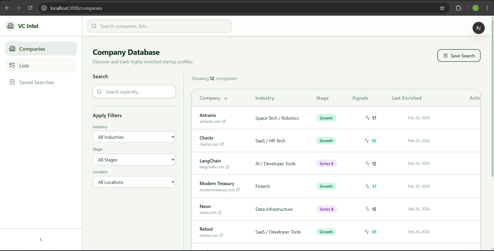
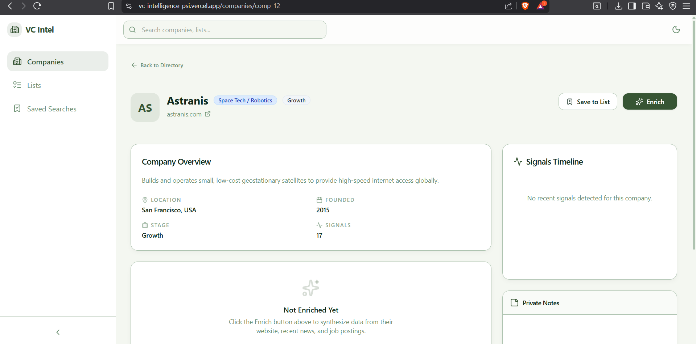
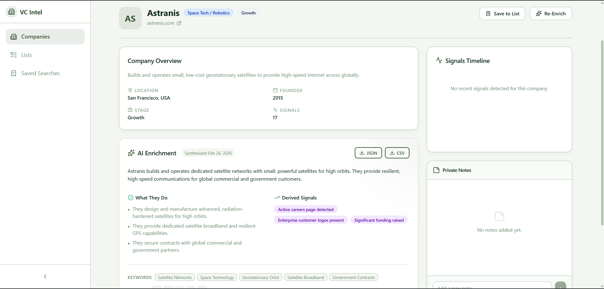
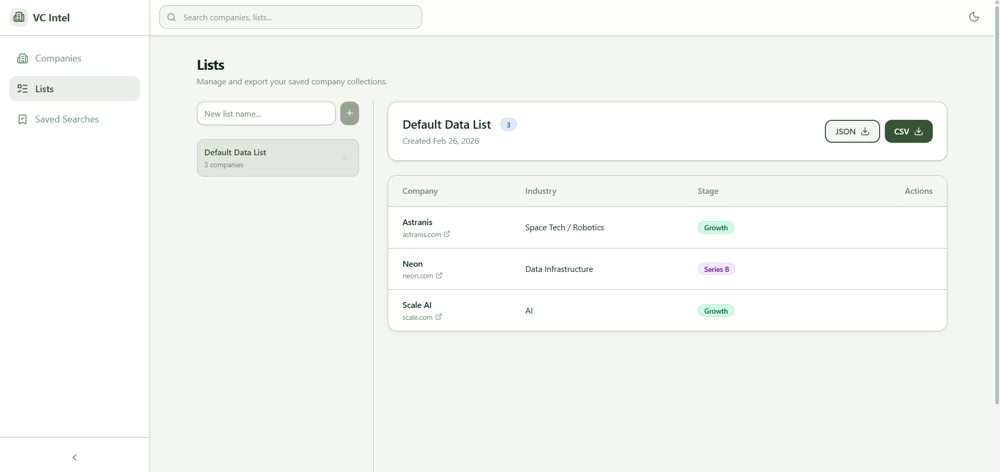
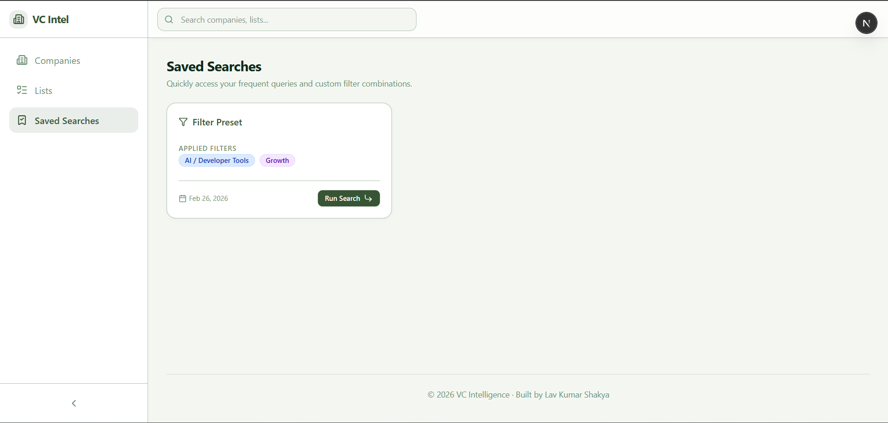

# VC Intelligence Interface with Live AI Enrichment

A production-style SaaS interface that simulates how venture capital firms discover, analyze, and track startup companies — built as an intern take-home assignment.

The system follows a structured workflow:

**Discover → View Profile → Enrich with Live Data → Derive Insights → Save to Lists**

It uses a mock company dataset for fast discovery, real-time enrichment from public websites, and AI-powered structured extraction to surface actionable intelligence.

---

## Live Demo

🔗 [Deployed Application](https://vc-intelligence-psi.vercel.app/companies)

---

## Key Features

- **Search & Filter** — Browse companies by industry, stage, and location with sortable columns and pagination
- **Company Profiles** — View company metadata, business signals, and private notes
- **Save to Lists** — Organize companies into custom lists with JSON/CSV export
- **Saved Searches** — Persist and re-run search queries across sessions
- **Live Enrichment** — Trigger real-time AI analysis from the company's official public website
- **Structured Output** — Receive a summary, bullet points, keywords, and derived business signals
- **Source Transparency** — Every scraped URL is logged with HTTP status, success flag, and timestamp
- **Local Caching** — Enrichment results are cached for 10 minutes to reduce redundant API calls

---

## Enrichment Pipeline

```
Frontend (React)
       │
       ▼
POST /api/enrich
       │
       ▼
Input Validation + SSRF Protection + Rate Limiting
       │
       ▼
Cache Check ─── HIT ──→ Return cached result (<100ms)
       │
      MISS
       │
       ▼
Public Page Fetch (/, /about, /docs, /blog, /careers)
       │
       ▼
HTML Sanitization (Cheerio)
       │
       ▼
AI Structured Extraction (Gemini 2.5 Flash)
       │
       ▼
Schema Validation (Zod)
       │
       ▼
Cache Store → JSON Response → UI Display
```

**Key design decisions:**

- All enrichment runs server-side — API keys are never exposed to the browser
- Only official, public website HTML is fetched — no access controls are bypassed
- A fallback crawl strategy attempts multiple paths (`/`, `/about`, `/docs`, `/blog`, `/careers`) to handle sites where the homepage alone may not contain enough content
- Pages with fewer than 300 readable characters are recorded but excluded from analysis

---

## Tech Stack

| Layer | Technology |
|---|---|
| Framework | Next.js 14 (App Router) |
| Language | TypeScript |
| Styling | Tailwind CSS |
| Icons | Lucide React |
| Backend | Next.js API Routes (Serverless) |
| HTML Parsing | Cheerio |
| AI Extraction | Google Gemini 2.5 Flash (`@google/genai`) |
| Validation | Zod |
| Persistence | localStorage |
| Deployment | Vercel |

---

## Security Considerations

- **API keys** are stored server-side only and never included in the client bundle
- **Only public data** is used — the scraper fetches standard HTML over HTTP/HTTPS
- **No access control bypass** — robots.txt-protected or login-gated content is not accessed
- **SSRF protection** blocks requests to private IPs and cloud metadata endpoints
- **Cross-domain redirects** are blocked to prevent data poisoning
- **Rate limiting** (5 req/min per IP) prevents abuse

---

## Setup Instructions

### 1. Clone the repository

```bash
git clone https://github.com/LavKumarShakya/VC-Intelligence.git
cd VC-Intelligence
```

### 2. Install dependencies

```bash
npm install
```

### 3. Configure environment variables

Create a `.env.local` file in the project root:

```env
GEMINI_API_KEY=your_gemini_api_key_here
```

> The API key is read server-side only and is required for the enrichment endpoint.

### 4. Run locally

```bash
npm run dev
```

Access the application at `http://localhost:3000`

### 5. Build for production

```bash
npm run build
```

---

## Screenshots

### Company Discovery


### Company Profile without Enrichment
      

### Company Profile with Enrichment


### Lists Management


### Saved Searches


---

## Repository Structure

```
VC-Intelligence/
├── src/
│   ├── app/
│   │   ├── api/enrich/       # Enrichment API route
│   │   ├── companies/        # Company list + profile pages
│   │   ├── lists/            # Lists management page
│   │   ├── saved/            # Saved searches page
│   │   └── layout.tsx        # Root layout with AppShell
│   ├── components/
│   │   ├── companies/        # CompanyTable, CompanyHeader, EnrichmentSection
│   │   ├── layout/           # AppShell, Sidebar, Topbar
│   │   └── ui/               # Button, Badge, Toast, Skeleton
│   ├── data/
│   │   └── mockCompanies.ts  # Mock company dataset
│   ├── lib/
│   │   ├── server/           # scraper, extractor, validator, security
│   │   ├── storage.ts        # localStorage utility
│   │   └── utils.ts          # Shared helpers
│   └── types/                # TypeScript interfaces
├── .env.local                # Environment variables (gitignored)
├── tailwind.config.ts
├── next.config.ts
└── package.json
```

---

## Future Improvements

These are architectural stretch goals outside the scope of this assignment:

- **Queue-based enrichment** — Background processing with progress indicators via WebSocket
- **Signal scoring** — Weighted scoring model to rank companies by investment potential
- **Vector similarity search** — Semantic search using embeddings for "find companies like X"
- **CRM integrations** — Export enriched profiles to HubSpot, Salesforce, or Notion
- **Persistent storage** — Replace localStorage with PostgreSQL for multi-device access
- **Authentication** — User accounts with role-based permissions

---

> This project focuses on shipping a usable product workflow with safe real-time enrichment under an 8-hour constraint.
